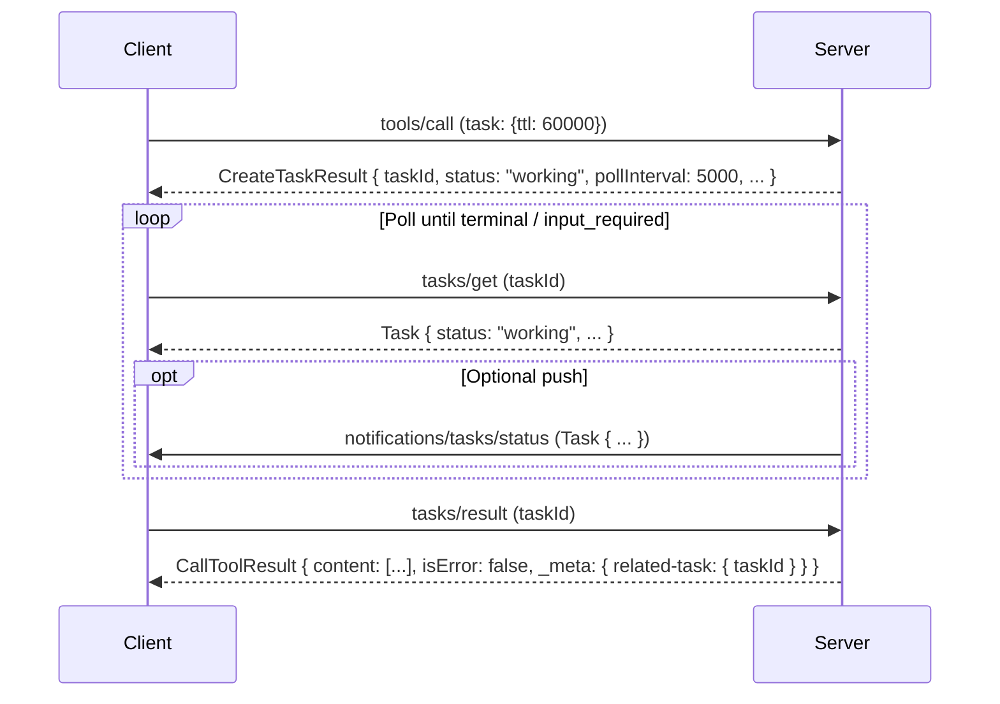

# MCP Tasks (Experimental): States, Polling, Notifications

## Purpose
The `tasks` utility (revision 2025-11-25) enables task-augmented requests: the receiver returns a `CreateTaskResult` immediately, and the requestor later retrieves the operation result via `tasks/result`.

## Task Object (shape highlights)
A `Task` includes (at minimum):
- `taskId` (string)
- `status` (string enum)
- `createdAt` (RFC3339 timestamp)
- `lastUpdatedAt` (RFC3339 timestamp)
- optional: `statusMessage`, `ttl` (ms), `pollInterval` (ms)

## Status Values (2025-11-25)
The spec uses these task statuses:
- `working`: non-terminal; operation is in progress
- `input_required`: non-terminal; operation needs additional input before it can continue
- `completed`: terminal; result is available via `tasks/result`
- `failed`: terminal; operation failed (details may appear in `statusMessage`)
- `cancelled`: terminal; operation was cancelled

## Polling vs Push
- **Polling (`tasks/get`) is the reliability baseline.** Requestors SHOULD respect `pollInterval` when choosing polling frequency, and SHOULD continue polling until the task reaches a terminal status or `input_required`.
- **Push (`notifications/tasks/status`) is optional.** Receivers MAY send it when status changes; requestors MUST NOT rely on receiving it.

## Result Retrieval
- `tasks/result` blocks until the task reaches a terminal status, then returns the **domain result** matching the original request type (e.g., `CallToolResult` for a task-augmented `tools/call`).
- Invoking `tasks/result` does **not** replace polling: requestors MAY continue polling `tasks/get` in parallel (e.g., to drive UI updates or recover from a cancelled/failed `tasks/result` attempt).

## Interaction Diagram (task-augmented `tools/call`)

## Implementation Notes (APM2-oriented)
- **Task storage**: keep task state in a bounded, session-aware TTL cache keyed by `taskId` to prevent cross-session leakage.
- **`pollInterval`**: treat as a load-shedding hint; pick a sane default and allow method-specific overrides for expensive work.
- **Streamable HTTP**: the spec allows clients to disconnect from an SSE stream opened in response to `tasks/get` or `tasks/result`; implementations still MUST comply with Streamable HTTP transport rules.
